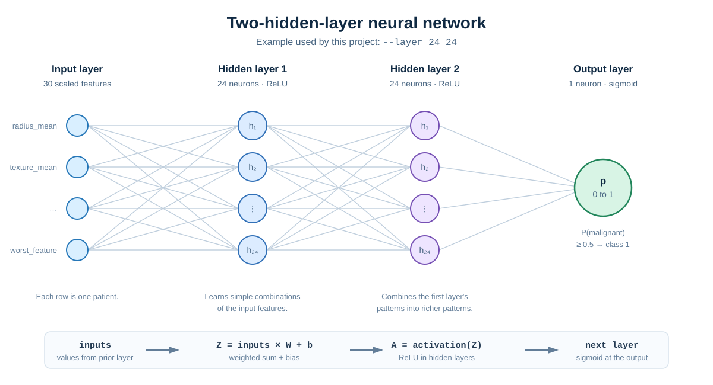
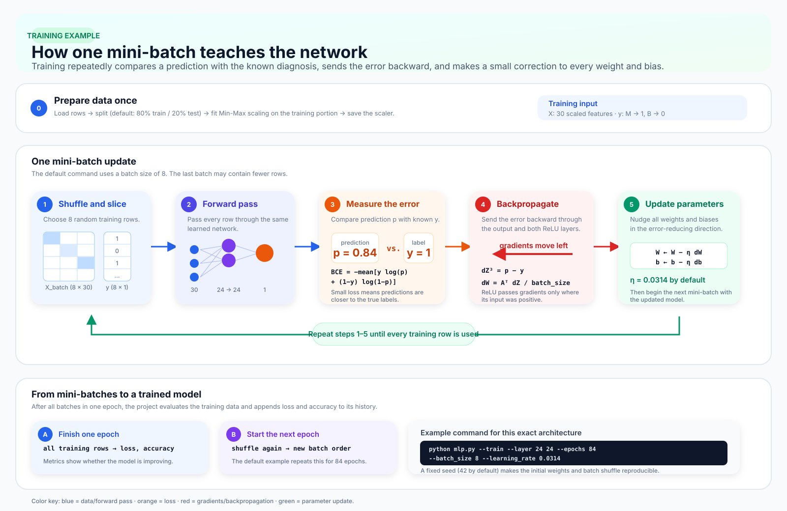

# Multilayer Perceptron — Breast Cancer Classification

This project implements a binary Multilayer Perceptron (MLP) from scratch
with NumPy. It classifies the Wisconsin Breast Cancer labels:

- `M` (malignant) becomes `1`.
- `B` (benign) becomes `0`.

The code is deliberately organized so that each class has one main job and
its public workflow methods read from the big picture down to the details.

## Project flow

```text
raw CSV
  -> Dataset loads and cleans the rows
  -> DataSplitter creates train/test files and a train-only Min-Max scaler
  -> ModelTrainer builds, trains, evaluates, plots, and saves the MLP
  -> ModelPredictor loads the model and evaluates or predicts
```

The network created by `ModelTrainer` has this shape:

```text
input features -> ReLU hidden layer(s) -> sigmoid output
```

The sigmoid output is a probability. A probability of `0.5` or greater is
reported as class `1`.

## Visual guide: two hidden layers

The command `--layer 24 24` builds the example below: the 30 scaled breast
cancer measurements enter two fully connected ReLU layers, each with 24
neurons. The final sigmoid neuron returns the probability of a malignant
diagnosis.



Every neuron takes all values from the preceding layer, gives each connection
a learned weight, adds a learned bias, and applies its activation function.
The lines in the diagram are representative: in the real network, every
neuron is connected to every neuron in the next layer.

## Visual guide: how training works

Training takes a small batch of patient rows, makes predictions, measures how
wrong they are, and sends that error backward to improve each weight and bias.



## Watch the network train

[Watch the 64-second colour-coded training walkthrough](images/mlp-training-walkthrough.mp4)

The captioned video follows one mini-batch from scaled input features through
both ReLU hidden layers, sigmoid probability, binary cross-entropy loss,
backpropagation, weight updates, and a final prediction for a new patient.
It uses the model implemented in this project: sigmoid is for its two output
classes; softmax is shown only as the alternative for a multiclass model.

To recreate the MP4, run:

```bash
python tools/generate_training_video.py
```

For example, this trains the illustrated network for 84 passes over the
training data, using batches of eight rows:

```bash
python mlp.py --train --layer 24 24 --epochs 84 --batch_size 8 --learning_rate 0.0314
```

## Install dependencies

```bash
python -m pip install -r requirements.txt
```

## Run the normal workflow

Run these commands from the project root.

```bash
# 1. Shuffle, split, Min-Max scale, and save the data.
python mlp.py --split --dataset data/data.csv --seed 42

# 2. Train a model using the generated files.
python mlp.py --train --layer 24 24 --epochs 84 --batch_size 8 --learning_rate 0.0314

# 3. Evaluate the saved model on the test set.
python mlp.py --predict --dataset data/test.csv --model output/saved_model.json
```

The split command creates `data/train.csv`, `data/test.csv`, and
`output/scaler.json`. Training saves the scaler inside the model JSON, along
with its layers, weights, and biases.

### Use custom output paths

If the scaler is not saved at the default location, pass its path when
training so the exact train-set scaler is stored with the model:

```bash
python mlp.py --split \
  --train_out prepared/train.csv \
  --test_out prepared/test.csv \
  --scaler_out prepared/scaler.json \
  --seed 42

python mlp.py --train \
  --train_data prepared/train.csv \
  --test_data prepared/test.csv \
  --scaler prepared/scaler.json \
  --model_out prepared/model.json
```

`--scaler` is also available with `--predict` when an older model does not
contain a scaler or when you deliberately need to override the saved one.

## What each file does

| File | Responsibility |
| --- | --- |
| `mlp.py` | Validates command-line options and starts split, train, or predict mode. |
| `src/data.py` | Loads labeled CSV files, cleans rows, splits data, scales features, and saves data/scalers. |
| `src/split.py` | Coordinates the preprocessing → split → scaler-fit → scale → save workflow. |
| `src/model.py` | Contains activation functions, loss functions, dense layers, backpropagation, evaluation, and model persistence. |
| `src/train.py` | Builds the network and coordinates training, test evaluation, plotting, and saving. |
| `src/predict.py` | Loads a model and either evaluates labeled data or predicts feature-only rows. |

## The important training math

For each dense layer, the forward pass is:

```text
Z = inputs @ weights + biases
A = activation(Z)
```

For this binary classifier, the final activation is sigmoid and the loss is
binary cross-entropy. Their combined output-layer gradient is:

```text
dZ = predicted_probability - true_label
```

Each layer then calculates:

```text
dW = inputs.T @ dZ / batch_size
db = sum(dZ) / batch_size
dA_previous = dZ @ weights.T
```

Training shuffles the rows, works through mini-batches, updates each layer,
and records loss and accuracy after every epoch.

## Use the model in Python

```python
from src.model import DenseLayer, MultilayerPerceptron

model = MultilayerPerceptron(seed=42)
first_layer = DenseLayer(24, activation="relu")
first_layer.build(input_features=30, rng=model.rng)
model.add(first_layer)

output_layer = DenseLayer(1, activation="sigmoid")
output_layer.build(input_features=24, rng=model.rng)
model.add(output_layer)
```

For normal use, `ModelTrainer.create_network([24, 24], input_features=30)`
builds this pattern for you.

## CSV formats

The raw Wisconsin dataset contains an ID column, an `M`/`B` diagnosis column,
and 30 numeric features. The generated train and test files contain the 30
scaled features followed by the diagnosis column.

Prediction also supports a feature-only CSV with 30 numeric columns. A file
with one leading ID column is accepted as well.
