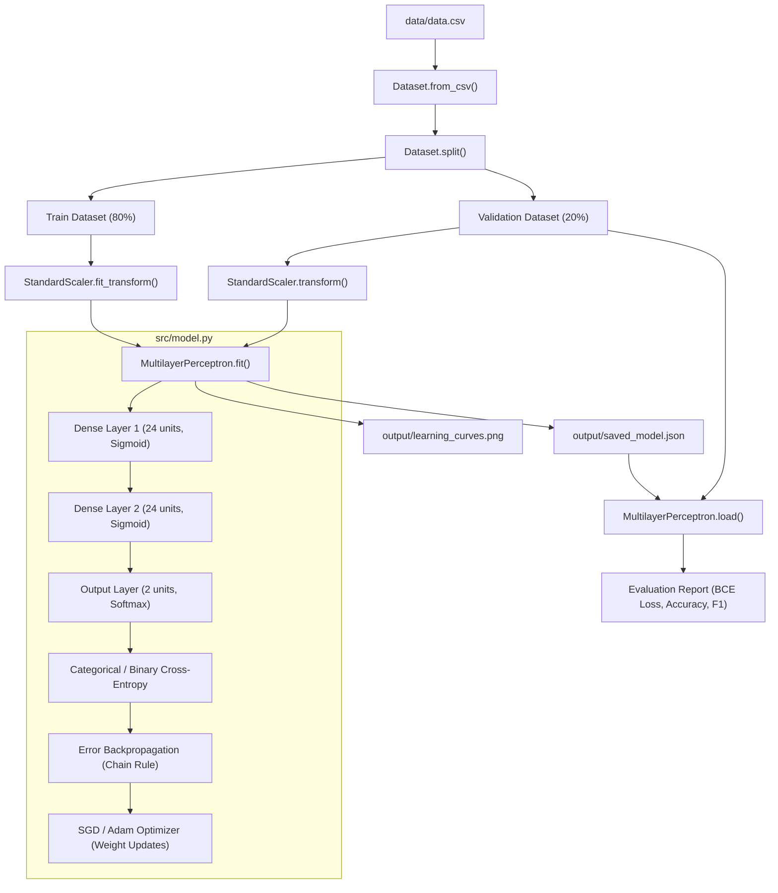

# Multilayer Perceptron — Architecture & Modular Design Guide

This document provides a comprehensive breakdown of the project architecture, class design, data flow, mathematical formulas, and evaluation explanations.

---

## 1. Project Overview & Folder Structure

```
multilayer-perceptron/
├── data/
│   ├── data.csv            # Original raw Wisconsin Breast Cancer dataset (569 samples, 32 columns)
│   ├── train.csv           # Generated training split (80% = 455 samples)
│   └── test.csv            # Generated validation/testing split (20% = 114 samples)
├── output/
│   ├── saved_model.json    # Trained model (topology, weights, biases, normalization parameters)
│   └── learning_curves.png # Visualized training vs validation loss & accuracy curves
├── docs/
│   └── ARCHITECTURE.md     # Full architectural explanation & defense preparation
├── src/
│   ├── __init__.py         # Package initializer
│   ├── data.py             # Data handling: Dataset & StandardScaler classes
│   ├── model.py            # Neural network engine: Dense, Activations, Losses, Optimizers, MLP
│   ├── split.py            # CLI wrapper for dataset separation
│   ├── train.py            # CLI wrapper for model training
│   └── predict.py          # CLI wrapper for prediction & evaluation
├── mlp.py                  # Unified CLI dispatcher (supports --split, --train, --predict)
├── requirements.txt        # Minimal dependencies (numpy, matplotlib)
└── README.md               # Quick-start guide
```

---

## 2. Modular Class Architecture

The codebase is built following clean Object-Oriented Programming (OOP) principles. Each class has a single, well-defined responsibility:



---

## 3. Detailed Component Breakdown

### A. Data Layer (`src/data.py`)

#### 1. `StandardScaler`
- **Purpose**: Normalizes continuous features to zero mean ($\mu = 0$) and unit variance ($\sigma = 1$):
  $$z = \frac{x - \mu}{\sigma + \epsilon}$$
- **Data Leakage Prevention**:
  - `fit(X_train)`: Computes $\mu$ and $\sigma$ **only** on the training set.
  - `transform(X)`: Applies the saved $\mu$ and $\sigma$ to validation or test data.
  - `to_dict()` / `from_dict()`: Saves $\mu$ and $\sigma$ inside `output/saved_model.json` so test data during prediction is normalized identically.

#### 2. `Dataset`
- **Purpose**: Encapsulates raw data arrays $X$ (features) and $y$ (labels).
- **Methods**:
  - `from_csv(filepath)`: Reads the CSV file using standard Python `csv` module, extracts 30 numeric features, converts diagnosis ('M' $\rightarrow 1$, 'B' $\rightarrow 0$), and ignores the ID column.
  - `split(train_ratio=0.8, seed=42)`: Shuffles deterministically using a seed and splits into training and validation datasets.
  - `batches(batch_size=8, shuffle=True)`: Python generator that yields mini-batches for gradient descent.
  - `to_one_hot(num_classes=2)`: Converts 1D label array to one-hot encoded matrix $[p_B, p_M]$.

---

### B. Network Engine (`src/model.py`)

#### 1. `Dense` (Layer Class)
- **State**:
  - `W`: Weight matrix of shape $(\text{input\_dim}, \text{units})$.
  - `b`: Bias row vector of shape $(1, \text{units})$.
  - `inputs`: Cached input activations $A^{[l-1]}$ from the forward pass.
  - `Z`: Cached linear combinations $Z^{[l]} = A^{[l-1]} W + b$.
- **Initialization**:
  - He Uniform ($W \sim \mathcal{U}(-\sqrt{6/n_{in}}, \sqrt{6/n_{in}})$) or Xavier Uniform.
- **Methods**:
  - `forward(inputs)`: Computes $Z = \text{inputs} \cdot W + b$, then $A = g(Z)$.
  - `backward(grad, is_delta=False)`: Computes gradients:
    $$\frac{\partial \mathcal{L}}{\partial W} = \frac{1}{m} (A^{[l-1]})^T \cdot \delta^{[l]}$$
    $$\frac{\partial \mathcal{L}}{\partial b} = \frac{1}{m} \sum_{\text{batch}} \delta^{[l]}$$
    Returns $dX = \delta^{[l]} \cdot W^T$ to propagate error to the previous layer.

#### 2. Activation Classes
- **`Sigmoid`**: $g(z) = \frac{1}{1 + e^{-z}}$, derivative $g'(z) = g(z)(1 - g(z))$.
- **`ReLU`**: $g(z) = \max(0, z)$, derivative $g'(z) = 1_{z > 0}$.
- **`Tanh`**: $g(z) = \tanh(z)$, derivative $g'(z) = 1 - \tanh^2(z)$.
- **`Softmax`**: $g(z)_i = \frac{e^{z_i - \max(z)}}{\sum_j e^{z_j - \max(z)}}$ (with numerical stability subtraction).

#### 3. Loss Classes
- **`BinaryCrossEntropy`**:
  $$E = -\frac{1}{N}\sum_{i=1}^N \left[ y_i \log(p_i) + (1 - y_i) \log(1 - p_i) \right]$$
- **`CategoricalCrossEntropy`**:
  $$\mathcal{L} = -\frac{1}{N}\sum_{i=1}^N \sum_{k=1}^K y_{ik} \log(p_{ik})$$

#### 4. Optimizer Classes
- **`SGD`**: $W \leftarrow W - \alpha \frac{\partial \mathcal{L}}{\partial W}$, $b \leftarrow b - \alpha \frac{\partial \mathcal{L}}{\partial b}$.
- **`Adam`**: Adapts learning rates per-weight using exponentially decaying moving averages of gradients ($m_t$) and squared gradients ($v_t$).

#### 5. `MultilayerPerceptron` (Model Class)
- Coordinates the entire neural network:
  - `add(layer)`: Adds a dense layer.
  - `forward(X)`: Propagates data sequentially through all layers.
  - `backward(y_true, y_pred)`: Backpropagates error in reverse from output layer to input layer.
  - `fit(...)`: Executes mini-batch gradient descent loop, tracks history, and displays epoch metrics.
  - `predict(X)`: Returns predicted class (0 for Benign, 1 for Malignant).
  - `evaluate(X, y)`: Computes BCE loss, accuracy, precision, recall, F1-score, and confusion matrix.
  - `save(path)`: Exports topology, weights, biases, and normalization scaler to human-readable JSON.
  - `load(path)`: Loads model state from JSON.

---

## 4. Mathematical Derivation Summary (For Defense)

### Forward Propagation
For each layer $l = 1, \dots, L$:
$$Z^{[l]} = A^{[l-1]} W^{[l]} + b^{[l]}$$
$$A^{[l]} = g^{[l]}(Z^{[l]})$$
*(where $A^{[0]} = X$ is the normalized input).*

### Output Error ($\delta^{[L]}$)
For Softmax output paired with Cross-Entropy loss, the gradient simplifies to:
$$\delta^{[L]} = \frac{\partial \mathcal{L}}{\partial Z^{[L]}} = \hat{y} - y$$

### Hidden Layer Error ($\delta^{[l]}$)
Using the multivariate chain rule:
$$\delta^{[l]} = (\delta^{[l+1]} (W^{[l+1]})^T) \odot g'^{[l]}(Z^{[l]})$$
*(where $\odot$ is element-wise multiplication).*

### Weight & Bias Gradients
$$\frac{\partial \mathcal{L}}{\partial W^{[l]}} = \frac{1}{m} (A^{[l-1]})^T \delta^{[l]}$$
$$\frac{\partial \mathcal{L}}{\partial b^{[l]}} = \frac{1}{m} \sum_{i=1}^m \delta^{[l]}_{i,:}$$

---

## 5. Command Reference & Usage

### 1. Data Split
```bash
python mlp.py --split --dataset data/data.csv --seed 42
```
*Outputs `data/train.csv` (80%) and `data/test.csv` (20%).*

### 2. Training
```bash
python mlp.py --train --layer 24 24 --epochs 84 --learning_rate 0.0314 --batch_size 8
```
*Customizable: `--layer 24 24 24`, `--activation relu`, `--optimizer adam`, `--early_stopping 10`.*
*Outputs `output/saved_model.json` and `output/learning_curves.png`.*

### 3. Prediction & Evaluation
```bash
python mlp.py --predict --dataset data/test.csv --model output/saved_model.json
```
*Evaluates using Binary Cross-Entropy loss and outputs full metrics report.*

